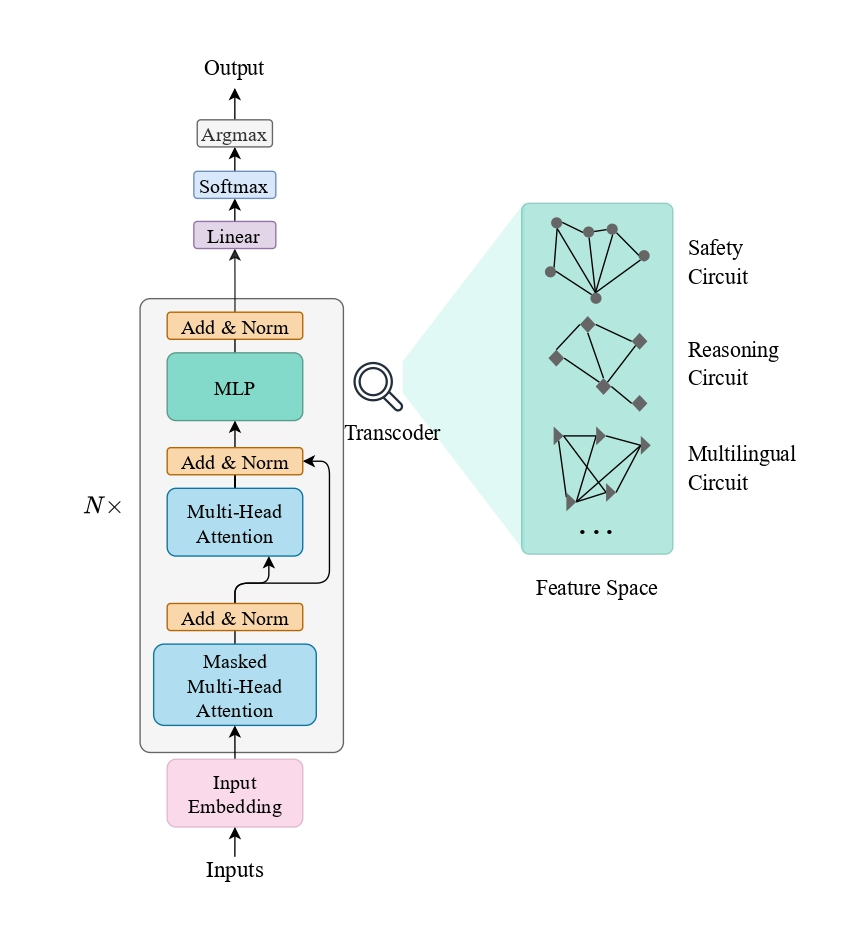

# Safe Evolution with Circuit Anchors

📄 **[Paper PDF](./Safe-Evolution-with-Circuit-Anchors.pdf)**

**Status:** Preprint. Under review.

## Overview

Current self-evolution algorithms for LLMs optimize purely for capability, causing models to *misevolve* — becoming powerful yet losing safety alignment. Inspired by how conserved Hox genes anchor biological body plans during evolution, we propose **Circuit-Anchored Evolution (CAE)**: identify a minimal safety circuit (<2% of features) via mechanistic interpretability, then anchor it during evolution while letting everything else adapt freely.

<p align="center">
  
</p>

## Citation

If you find this work useful, please cite:

```bibtex
@misc{liu2026safeevolution,
  title={Safe Evolution with Circuit Anchors},
  author={Yan Liu, Jie Fu, Tsung-Yi Ho},
  year={2026},
  howpublished={\url{https://github.com/theNamek/Safe-Evolution-with-Circuit-Anchors}},
  note={Preprint}
}
